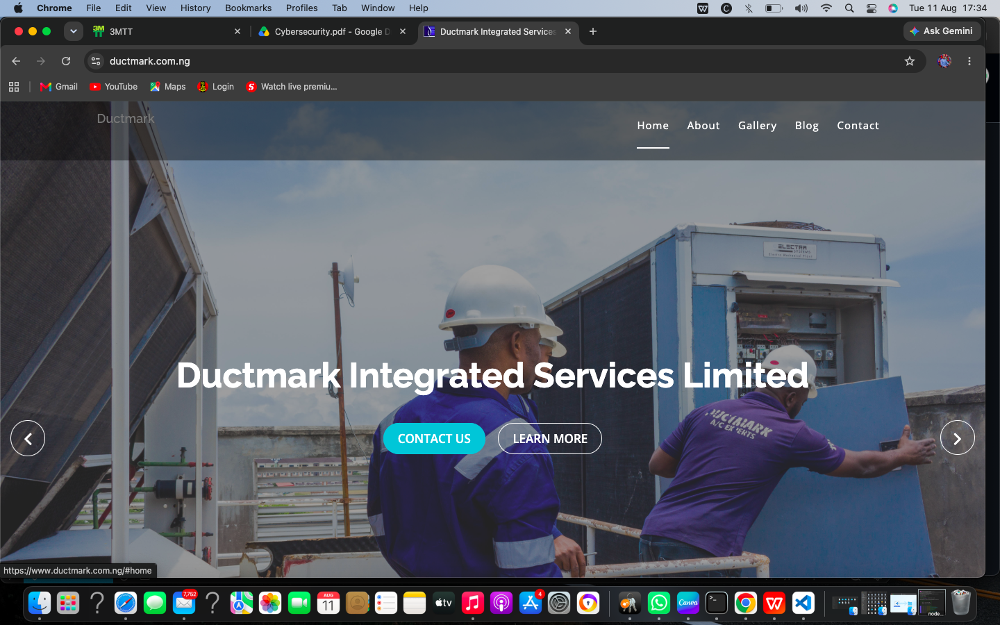
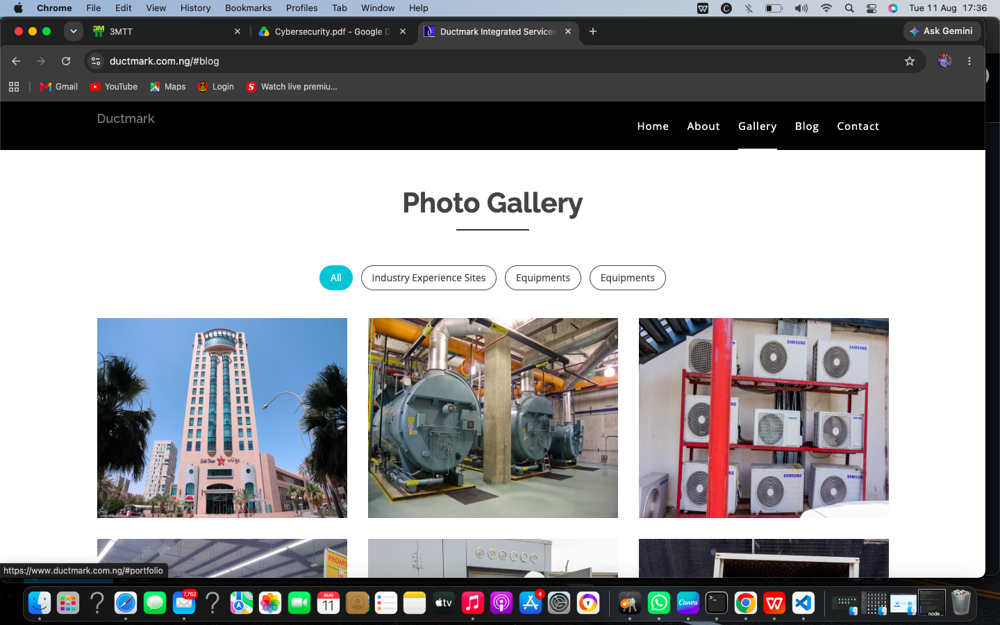

# Ductmark Corporate Website

**Live Website:** https://ductmark.com.ng

## Project Overview
This is a fully responsive corporate website I built for Ductmark.

## My Role
**Full-Stack Developer**  
Responsibilities: UI/UX Design, Frontend, Backend, Database, Deployment, SEO

## Technologies Used
- HTML5, CSS3, JavaScript
- PHP, MySQL
- cPanel Hosting

## Key Features
- Mobile responsive design
- Contact form with email
- SEO optimized pages
- Fast loading speed

## Contact
**Ismail Sulaimon**  
Email: ismailsulaiman306@gmail.com  
GitHub: https://github.com/ismailsulaimanXR-cell
## Live Website
🔗 https://ductmark.com.ng

## Screenshots

